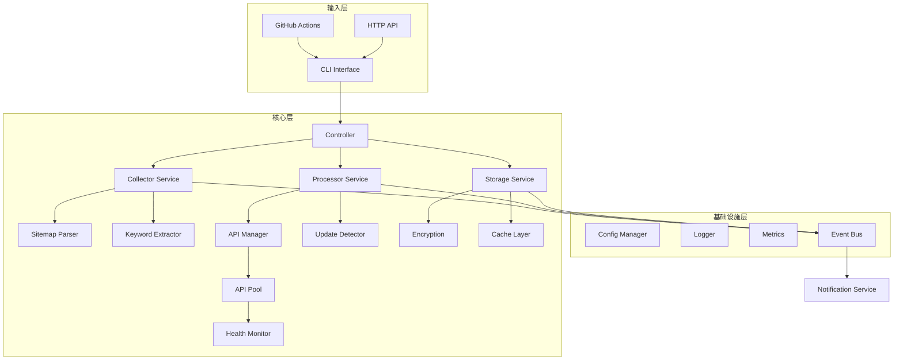

# 内容监控系统 Go 语言重构 PRD

## 1. 项目概述

### 1.1 背景
将现有的 Python 内容监控系统重构为 Go 语言实现，以获得更好的性能、并发处理能力和部署效率。

### 1.2 核心目标
- **性能提升**：利用 Go 的高并发特性，提升系统处理速度 5-10 倍
- **资源优化**：降低内存使用和 CPU 占用
- **部署简化**：编译为单一二进制文件，简化部署流程
- **可维护性**：采用清晰的架构设计，提高代码可维护性

### 1.3 技术选型
- **编程语言**：Go 1.21+
- **HTTP 库**：[Fiber](https://github.com/gofiber/fiber) v2 (基于 fasthttp，性能最优)
- **并发模型**：Goroutines + Channels
- **数据存储**：本地文件系统 + 内存缓存
- **加密库**：crypto/aes (标准库)
- **日志库**：[zerolog](https://github.com/rs/zerolog) (高性能结构化日志)
- **配置管理**：[viper](https://github.com/spf13/viper)

## 2. 功能需求

### 2.1 核心功能模块

#### 2.1.1 网站地图解析
- 支持 XML、XML.GZ、TXT、RSS 格式
- 并发解析多个 sitemap
- 智能格式检测和自适应解析
- 特殊网站定制化处理

#### 2.1.2 内容变更检测
- 高效的 URL 对比算法
- 增量更新检测
- 历史数据管理
- 变更通知机制

#### 2.1.3 关键词提取
- URL 路径智能分析
- 多语言关键词支持
- 关键词规范化处理
- 质量评分机制

#### 2.1.4 API 管理
- 多 API 并发查询
- 智能负载均衡
- 熔断器模式
- 自适应批处理

#### 2.1.5 数据安全
- AES-256 加密存储
- 敏感信息脱敏
- 安全的密钥管理
- 审计日志

### 2.2 非功能需求

#### 性能要求
- 单机处理能力：10,000+ URLs/分钟
- 并发 API 调用：100+ QPS
- 响应时间：< 100ms (本地处理)
- 内存占用：< 500MB

#### 可靠性要求
- 错误恢复机制
- 数据一致性保证
- 优雅关闭
- 健康检查接口

#### 可扩展性要求
- 插件化架构
- 水平扩展支持
- 配置热更新
- API 版本管理

## 3. 系统架构设计

### 3.1 整体架构



### 3.2 核心组件设计

#### 3.2.1 并发模型
```go
// 使用 Worker Pool 模式处理任务
type WorkerPool struct {
    workers   int
    taskQueue chan Task
    results   chan Result
    wg        sync.WaitGroup
}

// 使用 Pipeline 模式处理数据流
func Pipeline(ctx context.Context) {
    urls := fetchURLs(ctx)
    keywords := extractKeywords(ctx, urls)
    results := queryAPIs(ctx, keywords)
    saveResults(ctx, results)
}
```

#### 3.2.2 API 管理器
```go
type APIManager struct {
    pool       *APIPool
    limiter    *rate.Limiter
    breaker    *CircuitBreaker
    metrics    *Metrics
    
    // 自适应批处理
    adaptiveBatchSize int
    successRate       float64
}
```

#### 3.2.3 数据流设计
```go
// 使用 Channel 进行数据流转
type DataPipeline struct {
    urlChan     chan *URL
    keywordChan chan *Keyword
    resultChan  chan *Result
    errorChan   chan error
}
```

### 3.3 模块接口定义

#### 3.3.1 Sitemap 解析器接口
```go
type SitemapParser interface {
    Parse(ctx context.Context, url string) ([]URL, error)
    SupportedFormats() []string
    Validate(url string) error
}

type ParserFactory interface {
    GetParser(format string) SitemapParser
    RegisterParser(format string, parser SitemapParser)
}
```

#### 3.3.2 关键词提取器接口
```go
type KeywordExtractor interface {
    Extract(url string) ([]string, error)
    SetFilters(filters []Filter)
    Normalize(keyword string) string
}

type Filter interface {
    ShouldExclude(url *url.URL) bool
    Name() string
}
```

#### 3.3.3 API 客户端接口
```go
type APIClient interface {
    Query(ctx context.Context, keywords []string) (*APIResponse, error)
    HealthCheck(ctx context.Context) error
    GetMetrics() *APIMetrics
}

type APIPool interface {
    GetClient() (APIClient, error)
    ReturnClient(client APIClient)
    HealthStatus() map[string]HealthStatus
}
```

### 3.4 数据模型

#### 3.4.1 核心实体
```go
type URL struct {
    ID          string    `json:"id"`
    Address     string    `json:"address"`
    Keywords    []string  `json:"keywords"`
    LastUpdated time.Time `json:"last_updated"`
    Metadata    Metadata  `json:"metadata"`
}

type Keyword struct {
    Word        string  `json:"word"`
    SearchVolume int    `json:"search_volume"`
    Competition float64 `json:"competition"`
    CPC         float64 `json:"cpc"`
    UpdatedAt   time.Time `json:"updated_at"`
}

type Site struct {
    Domain      string    `json:"domain"`
    SitemapURLs []string  `json:"sitemap_urls"`
    LastChecked time.Time `json:"last_checked"`
    URLCount    int       `json:"url_count"`
}
```

#### 3.4.2 配置模型
```go
type Config struct {
    Server   ServerConfig   `mapstructure:"server"`
    Storage  StorageConfig  `mapstructure:"storage"`
    APIs     []APIConfig    `mapstructure:"apis"`
    Sites    []SiteConfig   `mapstructure:"sites"`
    Security SecurityConfig `mapstructure:"security"`
}
```

## 4. 技术实现方案

### 4.1 高性能 HTTP 处理

#### 使用 Fiber (基于 fasthttp)
```go
// 高性能 HTTP 客户端配置
client := &fasthttp.Client{
    MaxConnsPerHost:     100,
    MaxIdleConnDuration: 10 * time.Second,
    ReadTimeout:         5 * time.Second,
    WriteTimeout:        5 * time.Second,
    MaxConnWaitTimeout:  5 * time.Second,
    DisableHeaderNamesNormalizing: true,
    DisablePathNormalizing: true,
}

// 请求池化
var reqPool = sync.Pool{
    New: func() interface{} {
        return &fasthttp.Request{}
    },
}
```

### 4.2 并发控制策略

#### 4.2.1 Goroutine 池
```go
type GoroutinePool struct {
    maxWorkers int
    sem        chan struct{}
}

func (p *GoroutinePool) Submit(task func()) {
    p.sem <- struct{}{}
    go func() {
        defer func() { <-p.sem }()
        task()
    }()
}
```

#### 4.2.2 批处理优化
```go
func BatchProcess(items []Item, batchSize int, processFn func([]Item) error) error {
    var wg sync.WaitGroup
    errors := make(chan error, len(items)/batchSize+1)
    
    for i := 0; i < len(items); i += batchSize {
        end := min(i+batchSize, len(items))
        batch := items[i:end]
        
        wg.Add(1)
        go func(b []Item) {
            defer wg.Done()
            if err := processFn(b); err != nil {
                errors <- err
            }
        }(batch)
    }
    
    wg.Wait()
    close(errors)
    
    // 收集错误
    var errs []error
    for err := range errors {
        errs = append(errs, err)
    }
    
    return multierror.Append(nil, errs...)
}
```

### 4.3 内存优化

#### 4.3.1 对象池使用
```go
var (
    urlPool = &sync.Pool{
        New: func() interface{} {
            return &URL{}
        },
    }
    
    bufferPool = &sync.Pool{
        New: func() interface{} {
            return bytes.NewBuffer(make([]byte, 0, 4096))
        },
    }
)
```

#### 4.3.2 流式处理
```go
func StreamProcess(reader io.Reader) error {
    scanner := bufio.NewScanner(reader)
    scanner.Buffer(make([]byte, 64*1024), 1024*1024) // 64KB buffer, 1MB max
    
    for scanner.Scan() {
        line := scanner.Bytes()
        // 处理单行数据，避免一次性加载全部内容
        processLine(line)
    }
    
    return scanner.Err()
}
```

### 4.4 错误处理和重试

#### 4.4.1 智能重试机制
```go
type RetryConfig struct {
    MaxAttempts int
    InitialDelay time.Duration
    MaxDelay     time.Duration
    Multiplier   float64
}

func RetryWithBackoff(ctx context.Context, config RetryConfig, fn func() error) error {
    delay := config.InitialDelay
    
    for attempt := 0; attempt < config.MaxAttempts; attempt++ {
        err := fn()
        if err == nil {
            return nil
        }
        
        if !isRetryable(err) {
            return err
        }
        
        if attempt < config.MaxAttempts-1 {
            select {
            case <-time.After(delay):
                delay = time.Duration(float64(delay) * config.Multiplier)
                if delay > config.MaxDelay {
                    delay = config.MaxDelay
                }
            case <-ctx.Done():
                return ctx.Err()
            }
        }
    }
    
    return fmt.Errorf("max retry attempts reached")
}
```

### 4.5 监控和可观测性

#### 4.5.1 Metrics 收集
```go
type Metrics struct {
    RequestsTotal   prometheus.Counter
    RequestDuration prometheus.Histogram
    ErrorsTotal     prometheus.Counter
    ActiveWorkers   prometheus.Gauge
}

func (m *Metrics) RecordRequest(duration time.Duration, err error) {
    m.RequestsTotal.Inc()
    m.RequestDuration.Observe(duration.Seconds())
    if err != nil {
        m.ErrorsTotal.Inc()
    }
}
```

#### 4.5.2 分布式追踪
```go
func TraceRequest(ctx context.Context, operationName string) (context.Context, func()) {
    span, ctx := opentracing.StartSpanFromContext(ctx, operationName)
    return ctx, func() {
        span.Finish()
    }
}
```

## 5. 部署方案

## 6. 性能优化策略

### 6.1 并发优化
- 使用 goroutine pool 限制并发数
- 批量处理减少 API 调用
- 异步 I/O 操作
- 预分配内存减少 GC 压力

### 6.2 缓存策略
- 多级缓存：内存 -> 磁盘
- LRU 缓存淘汰策略
- 缓存预热机制
- 分布式缓存支持

### 6.3 网络优化
- HTTP/2 连接复用
- 请求合并和批处理
- 自适应超时设置
- DNS 缓存

## 7. 测试策略

### 7.1 单元测试
```go
func TestKeywordExtractor(t *testing.T) {
    tests := []struct {
        name     string
        url      string
        expected []string
    }{
        {
            name:     "game URL",
            url:      "https://example.com/game/123/super-mario.html",
            expected: []string{"super", "mario"},
        },
    }
    
    for _, tt := range tests {
        t.Run(tt.name, func(t *testing.T) {
            result := ExtractKeywords(tt.url)
            assert.Equal(t, tt.expected, result)
        })
    }
}
```

### 7.2 性能测试
```go
func BenchmarkSitemapParser(b *testing.B) {
    parser := NewSitemapParser()
    data := loadTestData()
    
    b.ResetTimer()
    for i := 0; i < b.N; i++ {
        _, _ = parser.Parse(data)
    }
}
```

### 7.3 集成测试
- API 模拟测试
- 端到端测试
- 负载测试
- 混沌工程测试

## 8. 项目里程碑

### Phase 1: 基础架构 (2周)
- [x] 项目结构搭建
- [ ] 核心接口定义
- [ ] 配置管理实现
- [ ] 日志系统集成

### Phase 2: 核心功能 (3周)
- [ ] Sitemap 解析器
- [ ] 关键词提取器
- [ ] API 客户端池
- [ ] 数据存储层

### Phase 3: 高级功能 (2周)
- [ ] 并发控制优化
- [ ] 熔断器实现
- [ ] 缓存系统
- [ ] 监控指标

### Phase 4: 测试与优化 (2周)
- [ ] 单元测试覆盖
- [ ] 性能测试
- [ ] 内存优化
- [ ] 文档完善

### Phase 5: 部署与运维 (1周)
- [ ] CI/CD 配置
- [ ] 容器化部署
- [ ] 监控告警
- [ ] 运维文档

## 9. 风险评估

### 技术风险
- **并发控制复杂性**：需要仔细设计避免竞态条件
- **内存管理**：大量数据处理可能导致内存问题
- **API 限流**：需要实现智能的限流和重试机制

### 缓解措施
- 充分的测试覆盖
- 渐进式性能优化
- 完善的监控和告警
- 灰度发布策略

## 10. 成功标准

### 性能指标
- 处理速度提升 5-10 倍
- 内存使用降低 50%
- API 调用成功率 > 99%
- 系统可用性 > 99.9%

### 功能指标
- 支持所有原有功能
- 新增实时监控能力
- 支持水平扩展
- 提供 REST API 接口

---

**文档版本**: v1.0  
**创建日期**: 2025-06-25  
**作者**: 系统架构师